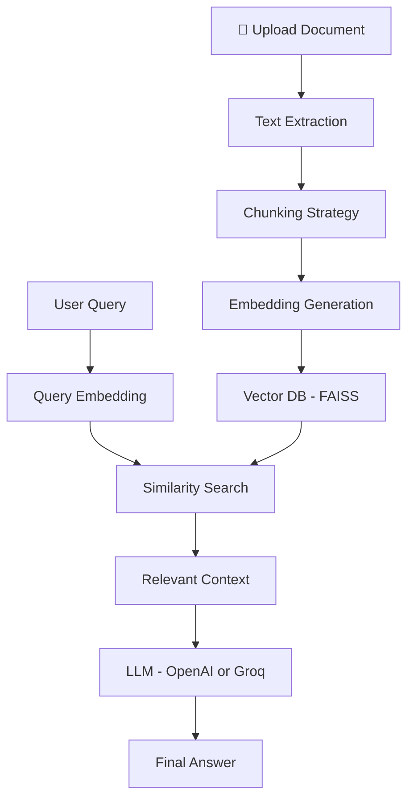

# 🧠 Ask My Document

### 📄 Intelligent RAG-Based AI Question Answering System


---

## ✨ Overview

**Ask My Document** is an advanced **AI-powered Question Answering System** built using **Retrieval-Augmented Generation (RAG)**.

It enables users to:

* 📄 Upload documents (PDF/Text)
* 💬 Ask questions in natural language
* 🧠 Receive **accurate, context-aware answers grounded in their data**

> ⚡ Unlike traditional LLM apps, this system eliminates hallucination by combining **semantic search + LLM reasoning**.

---

## 🚨 The Problem

Modern AI chatbots:

* ❌ Don’t understand your private data
* ❌ Give generic or incorrect answers
* ❌ Hallucinate when context is missing

---

## 💡 The Solution

This project solves it using **RAG Architecture**:

> 🔍 Retrieve → 🧠 Understand → ✍️ Generate

✔ AI answers ONLY from your document
✔ Improves accuracy & trustworthiness
✔ Works without retraining large models

---

## 🧠 What Makes This Project Stand Out

* 🔥 Implements **end-to-end RAG pipeline**
* ⚡ Uses **vector embeddings + FAISS similarity search**
* 🎯 Demonstrates **LLM system design (important for interviews)**
* 💼 Real-world **enterprise-ready use case**
* 🚀 Combines **AI + Backend + UI**

---

## ⚙️ System Architecture



---

## 🔄 End-to-End Workflow

### 1️⃣ Document Ingestion

* Extract text from PDFs
* Clean and structure data

### 2️⃣ Smart Chunking

* Split text into meaningful chunks
* Improves retrieval precision

### 3️⃣ Embedding Creation

* Convert text → numerical vectors
* Captures semantic meaning

### 4️⃣ Vector Storage

* Store embeddings in **FAISS**
* Enables ultra-fast similarity search

### 5️⃣ Query Processing

* User query → embedding
* Retrieve most relevant chunks

### 6️⃣ Answer Generation

* Context + Query → LLM
* Generate grounded response

---

## 🧰 Tech Stack

| Layer         | Technology           | Purpose                |
| ------------- | -------------------- | ---------------------- |
| 🧠 LLM        | OpenAI / Groq        | Answer generation      |
| 🔗 Framework  | LangChain            | Pipeline orchestration |
| 📦 Vector DB  | FAISS                | Semantic search        |
| 🔍 Embeddings | OpenAI / HuggingFace | Text vectorization     |
| 💻 Backend    | Python               | Core logic             |
| 🎨 Frontend   | Streamlit            | User interface         |

---

## ✨ Key Features

✔ 📄 Upload custom documents
✔ 💬 Natural language Q&A
✔ 🔍 Semantic search (not keyword-based)
✔ ⚡ Real-time responses
✔ 🧠 Context-aware answers
✔ 🚫 Reduced hallucination
✔ 📊 Scalable architecture

---

## 📊 Why RAG is Powerful

| Traditional LLM      | RAG System           |
| -------------------- | -------------------- |
| Static knowledge     | Dynamic knowledge    |
| Hallucinations       | Grounded answers     |
| No personalization   | Works on your data   |
| Expensive retraining | No retraining needed |

---

## 💼 Real-World Applications 

* 🏢 Enterprise knowledge assistant
* 📄 Legal & compliance document analysis
* 🏥 Healthcare records Q&A
* 🎓 Student study assistant
* 📚 Research paper summarization

---

## 🚀 How to Run Locally

```bash
# Clone the repository
git clone https://github.com/kobbajiaishwarya/Ask-My-Document-RAG-based-AI-Q-A-System.git

# Navigate into the project
cd Ask-My-Document-RAG-based-AI-Q-A-System

# Install dependencies
pip install -r requirements.txt

# Run the application
streamlit run app.py
```

---

## 📁 Project Structure

```
├── app.py                # Streamlit application
├── requirements.txt     # Dependencies
├── utils/               # Helper modules
├── data/                # Sample documents
└── README.md
```

---


## 🧑‍💻 Author

**Aishwarya Kobbaji**
🎓 Master’s in Business Analytics & Artificial Intelligence
🤖 AI Engineer | Machine Learning  

---

## ⭐ Show Your Support

If you found this project useful:

👉 Give it a ⭐ on GitHub
👉 Share it with others
